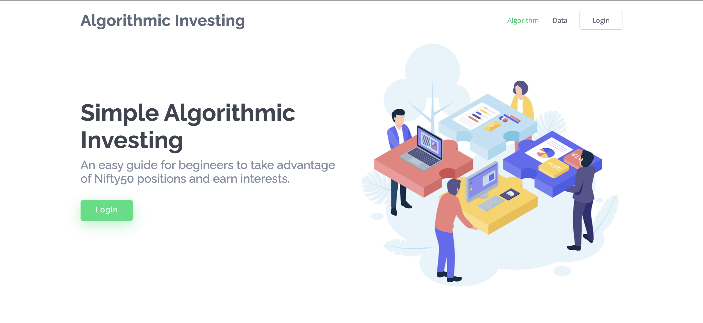
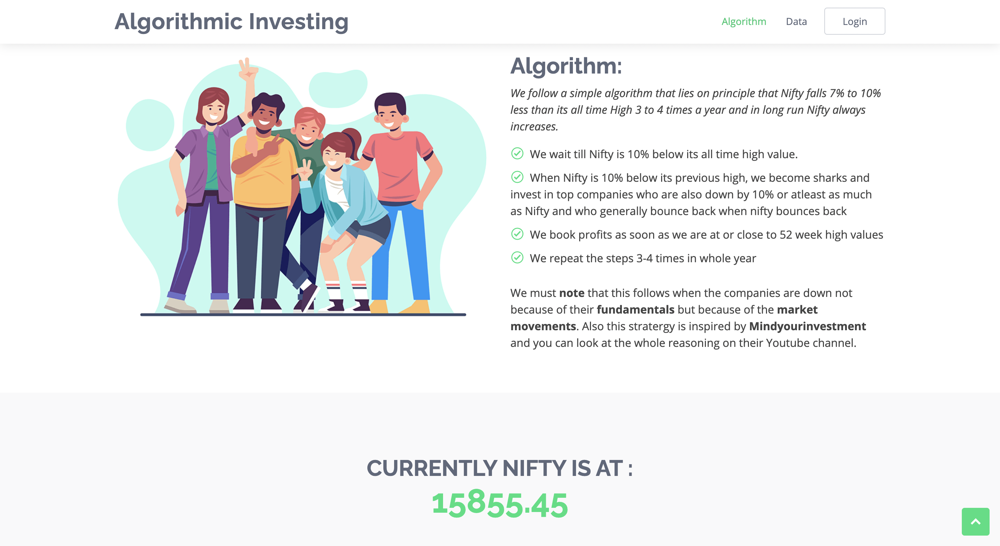
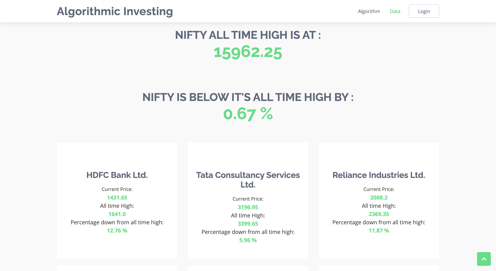
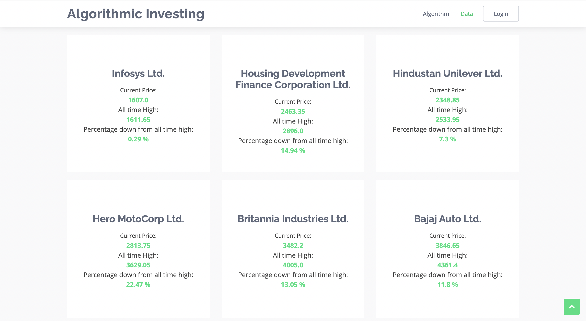
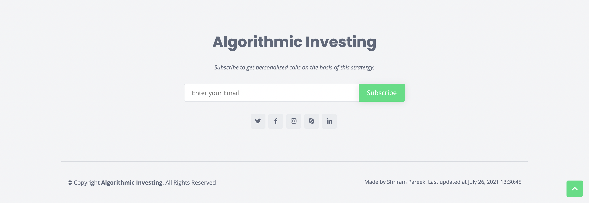

# Algorithmic Investor
> It is Investment Advisor that gives automatic calls to users depending on situation.
<!-- > Live demo [_here_](https://www.example.com). If you have the project hosted somewhere, include the link here. -->

## Table of Contents
* [General Info](#general-information)
* [Technologies Used](#technologies-used)
* [Features](#features)
* [Screenshots](#screenshots)
* [Setup](#setup)
* [Usage](#usage)
* [Project Status](#project-status)
* [Contact](#contact)
<!-- * [License](#license) -->

## General Information
- For most people, tracking their investments, and deciding next steps on market conditions becomes difficult as they cannot afford the time to track and analyise markets closely
- Many are confused on what shares to choose for short term or long term gains
- Many donot have a defined stratergy, which most of the times result in losses, so to overcome these problems, this project is implemented
<!-- You don't have to answer all the questions - just the ones relevant to your project. -->

## Technologies Used
- Python - (flask, flask_bcrypt, pymongo)
- HTML/CSS/Bootstrap
- MongoDB

## Features
- It follows an algorithm, which lies under principle that every year around 2-3 times, market falls around 7-10% its all time high and when this happens, the top 10-20 companies also exhibits this behavior, Such situation occurs mostly due to heavy fund movements from FIIs, DIIs and can be used as an opportunity, provided we follow the rules.
- The app monitors this situation closely and whenever there is such opportunity, it automatically sends mail to all the registered mail addresses
- Information is also stored on server, to reduce down-time

## Screenshots

<!-- If you have screenshots you'd like to share, include them here. -->

## Setup
- MongoDB server should be started at port 27017
- Pymongo, flask, bson, json, update_route should be installed
- First time database creation and insertion can be done by `python Fetch_Once.py`

## Usage
After setup,
`python app.py` does the work.

## Project Status
Project is: _In progress_ 

## Contact
Created by [Shriram Pareek](https://github.com/Shrirampareek888) - feel free to contact me!

<!-- Optional -->
<!-- ## License -->
<!-- This project is open source and available under the [... License](). -->

<!-- You don't have to include all sections - just the one's relevant to your project -->
